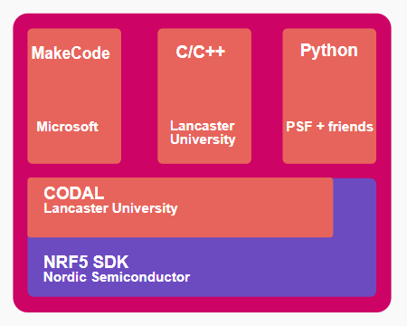

# Setting up CODAL programming environment (on Windows)

- [Setting up CODAL programming environment (on Windows)](#setting-up-codal-programming-environment-on-windows)
  - [Overview](#overview)
  - [Install the cross compiler](#install-the-cross-compiler)
  - [Install build tools](#install-build-tools)
  - [Download CODAL and run some example files](#download-codal-and-run-some-example-files)

## Overview

This part is fairly straightforward thanks to the chip on micro:bit that specifically handles the interface between your computer and the board. With this chip, micro:bit appears as a standard flash drive on you computer and uploading a compiled program is as simple as copying the `.hex` file onto that drive.

## Install the cross compiler

To run C code on the micro:bit board, we will be using the [arm-none-eabi-gcc](https://developer.arm.com/tools-and-software/open-source-software/developer-tools/gnu-toolchain/gnu-rm/downloads) cross compiler. It is called a cross compiler because it runs on the x86 platform (out computer) but generate compiled code that works on ARM (micro:bit).

 1. In the link above, download the file called `gcc-arm-none-eabi-10.3-2021.07-win32.exe`. The exact version number may be different--you can safely download the newest version.
 2. Make sure to check `Add path to environment variable` to ensure that other programs can find the compiler. .png)
 3. Open Windows PowerShell and type `arm-none-eabi-gcc -v` to verify that it is correctly installed. If it is not recognized, restart PowerShell and try again. .png)

## Install build tools

To make the build process easier, we will need [CMake](https://cmake.org/download) and [Ninja](https://github.com/ninja-build/ninja/releases). These are called "build tools" because they automate the build process so you don't have to do some extensive setups every time you change your code. In theory you can also build projects manually using the compiler, without the help of any build tools, but this quickly becomes unfeasible as the project size grows.

1. In the link for CMake, download the file `cmake-3.21.2-windows-x86_64.msi` under the "Binary distributions" section. Again the exact version number may be different.
2. Make sure to select `Add CMake to the system PATH` during its installation. .png)
3. To install Ninja, a simple solution is to download `ninja-win.zip` from the above link, then extract the `ninja.exe` file to the `C:\Program Files\CMake\bin` directory (or whatever path you chose for CMake if not this default path). .png)
4. Verify they are installed by running the following commands in PowerShell: `cmake --version` and `ninja --version`. If any of these are not recognized, restart PowerShell and try again. .png)

## Download CODAL and run some example files
Finally we will need to download the CODAL library as well as some example files.

1. Download and install [Git](https://git-scm.com/).
2. Clone [this repository](https://github.com/lancaster-university/microbit-v2-samples). You can also simply download the `.zip` file using the link and decompress it to a directory of your choice if you don't want to clone it.
3. Use [VS Code](https://code.visualstudio.com/) to open the directory you just cloned/downloaded.
4. Click on the `CMakeLists.txt` file. A pop-up window will appear asking if you want to install an addon for CMake. Select "Yes". .png)
5. After installing the addon there should be a new extension for it on your side bar. Click on it and find "Configure All Projects" then select the `GCC arm-none-eabi` compiler. CMake will then automatically clone the CODAL libraries to the `library` sub directory in the project folder. This may take some time. If you can't find the `GCC arm-none-eabi` compiler, restart VS Code and try again. .png)
6. After configuration is finished you should have everything that you need to build a simple example program. In the project directory, take a look at `source`->`main.cpp` and it should be pretty clear what the code is doing. Click the `Build` button on the bottom status bar of VS Code. .png)
7. If the build process succeeds there should be a `MICROBIT.hex` file in the project directory. Copy it onto the micro:bit drive and see it work. You have now successfully set up the environment for working with CODAL! :)